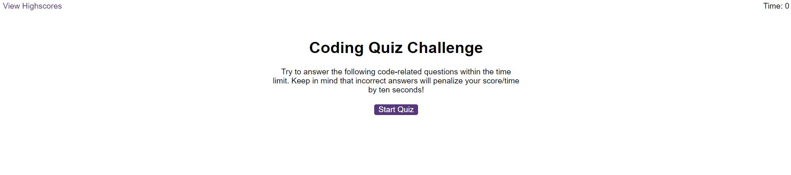
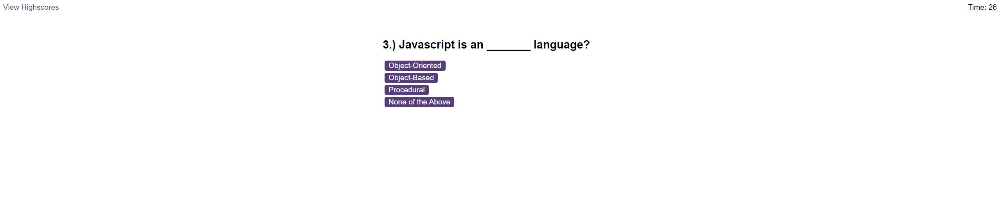
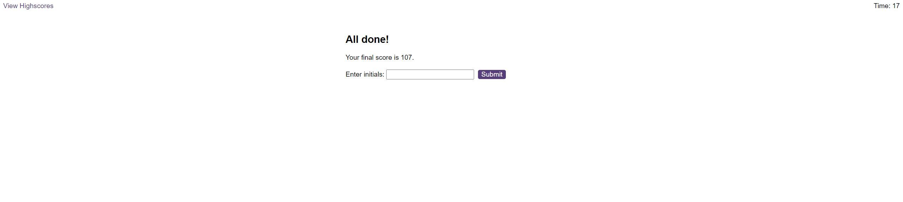

# Module 6 Challenge Web APIs: Code Quiz

## Overview

In this week's challenge, I've been tasked with creating a code quiz that will run in the browser.

The quiz is based on basic JavaScript fundementals. See below for more information about the project.

This will challenge my knowledge and learnings within JavaScript as I will have to use:
  - Event listeners
  - Local storage
  - DOM manipulation
  - Timers

## Technologies Used and Project Structure

* **HTML**
  * **index.html** - The main landing page for the entire quiz.
  * **highscores.html** - the page that displays the highscores page for the quiz.
* **JavaScript**
  * **logic.js** - Contains the logic for the entire quiz.
  * **questions.js** - Contains the quiz questions and answers.
  * **scores.js** - Contains the logic for the highscores html page including the local storage functionality.
* **CSS**
  * **style.css** - Contains the stying for the entire quiz.
* **README.md** - The page you're looking at right now!

## Instructions/Demo for users

1. Open the page from the [deployed link](TO BE COMPLETED) - see below image for reference.


2. Click the button to start the quiz. The quiz questions will appear.


3. Once the quiz has been completed, user will be presented with the high scores page.


4. Users may then log their high scores. Where their initials and scores will be logged locally and stored.


5. If the user wants to clear the HighScores, just press the "CLear Highscores" button. This will clear the locally saved high scores.

6. Users can also press "Go Back" to return to the start page for the quiz

## Features

- When the "Start Quiz" button is clicked, the quiz will begin. Simultaneously, the timer starts counting down from 60 seconds at an increment of 1 second per second.

- A correct answer will display "Correct!", play the correct answer sound and the next question will appear. User's score will increase by 10 points.

- An incorrect answer will display "Wrong!", play the wrong answer sound and the next question will appear. the timer will decrease by 10 seconds.

- Once timer reaches 0 seconds, the quiz will end. User will be presented with the high scores page. User will be able to log their initials and score.

- How is the final score calculated??
  - This is the sum of the user's time left in the quiz upon completion + the score they obtained from the 10 questions.

## Contact

Feel free to contact me if you have any questions or just want to connect:

* [Click here to email me](mailto:aaronarmstrong1490@gmail.com)
* [Connect with me on LinkedIn](https://www.linkedin.com/in/aaron-armstrong-%E8%89%BE%E4%BF%8A%E6%A8%82-80986ba5/)

## Links

* [Link to the deployed page](TO BE COMPLETED)
* [Link to the GitHub repository](https://github.com/aaron1490/coding-quiz-challenge)


## Your Task

As you proceed in your journey to becoming a front-end web developer, it’s likely that you’ll be asked to complete a coding assessment, perhaps as part of an interview process. A typical coding assessment is a combination of multiple-choice questions and interactive coding challenges. 

To help you become familiar with these tests and give you a chance to apply the skills from this module, this week’s challenge invites you to build a timed coding quiz with multiple-choice questions. This app will run in the browser, and will feature dynamically updated HTML and CSS powered by JavaScript code that you write. It will have a clean, polished, and responsive user interface. This week’s coursework has taught you all the skills you need to succeed in this challenge.


## User Story

```
AS A coding boot camp student
I WANT to take a timed quiz on JavaScript fundamentals that stores high scores
SO THAT I can gauge my progress compared to my peers
```

## Acceptance Criteria

Create a code quiz that contains the following requirements:

* A start button that when clicked a timer starts and the first question appears.
 
  * Questions contain buttons for each answer.
  * 
  * When answer is clicked, the next question appears
  * 
  * If the answer clicked was incorrect then subtract time from the clock

* The quiz should end when all questions are answered or the timer reaches 0.

  * When the game ends, it should display their score and give the user the ability to save their initials and their score
  
## Mock-Up

The following animation demonstrates the application functionality:


## Grading Requirements

This challenge is graded based on the following criteria: 

### Technical Acceptance Criteria: 40%

* Satisfies all of the above acceptance criteria.

### Deployment: 32%

* Application deployed at live URL.

* Application loads with no errors.

* Application GitHub URL submitted.

* GitHub repository that contains application code.

### Application Quality: 15%

* Application user experience is intuitive and easy to navigate.

* Application user interface style is clean and polished.

* Application resembles the mock-up functionality provided in the challenge instructions.

### Repository Quality: 13%

* Repository has a unique name.

* Repository follows best practices for file structure and naming conventions.

* Repository follows best practices for class/id naming conventions, indentation, quality comments, etc.

* Repository contains multiple descriptive commit messages.

* Repository contains quality README file with description, screenshot, and link to deployed application.


## Review

You are required to submit BOTH of the following for review:

* The URL of the functional, deployed application.

* The URL of the GitHub repository. Give the repository a unique name and include a README describing the project.

---
© 2023 edX Boot Camps LLC. Confidential and Proprietary. All Rights Reserved.
